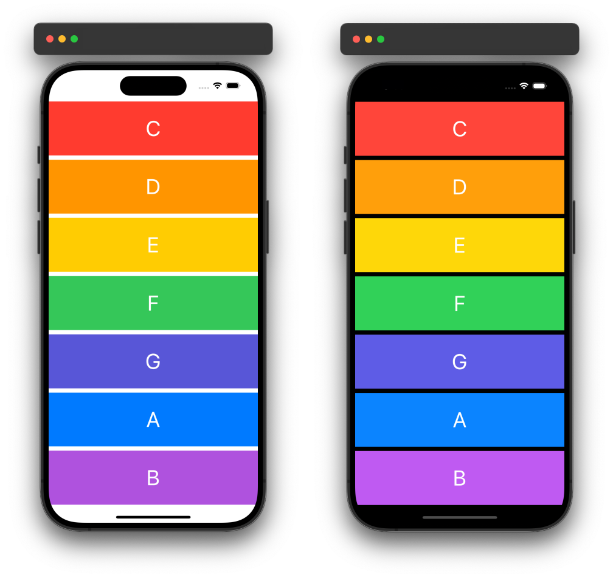

# EggTimer

## Introduction

EggTimer is a simple iOS application designed to play sound effects when different buttons are pressed. It utilizes the AVFoundation framework to handle audio playback, making it easy for users to interact with and enjoy.

### Preview

<div style="text-align: center;">
  
</div>

## Features

- **Simple User Interface:** Intuitive design with buttons to play various sound effects.
- **Audio Playback:** Plays sound files in WAV format when buttons are pressed.
- **AVFoundation Integration:** Leverages the AVAudioPlayer class from AVFoundation for audio playback.

## Code Structure

The main components of the application are:

### ViewController.swift

This file contains the primary logic for handling button presses and playing audio.

```swift
import UIKit
import AVFoundation

class ViewController: UIViewController {
    
    var player: AVAudioPlayer!
    
    override func viewDidLoad() {
        super.viewDidLoad()
    }

    @IBAction func keyPressed(_ sender: UIButton) {
        let soundName = sender.currentTitle
        let url = Bundle.main.url(forResource: soundName, withExtension: "wav")
        player = try! AVAudioPlayer(contentsOf: url!)
        player.play()
    }
}
```

### Main.storyboard

The storyboard file defines the user interface, including buttons that trigger audio playback when pressed. Each button is linked to the `keyPressed` action in the `ViewController`.

## Conclusion

EggTimer is a straightforward and fun application that demonstrates basic audio playback functionality in iOS. By integrating AVFoundation, it provides an excellent example of how to work with audio in your apps. Feel free to explore and expand the app with additional features or sound effects.